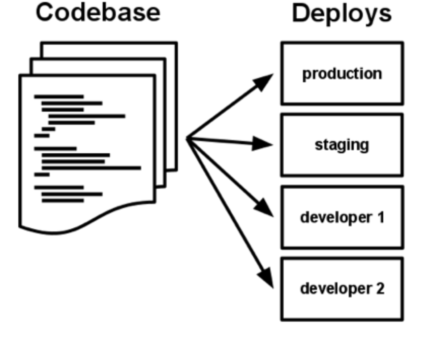

# 12 factor
- software como servicio
## Caracteristicas
- declarativo
- portabilidad maxima
- uso de plataformas en la nube.
- Minimizar la diferencia entre distintos ambientes(production, staginsX, desarrollo), permitiendo entrega continua(continuous deployment)
- facil de escalar, sin cambios significativos en la arquitectura.

## 1. Codigo base
- Un codigo base dirigido por un software de version.
- muchas entregas
- Codigo base -> repositorio unico

- correlacion 1 a 1
- - si hay multiples codigos base no es una app, es un sistema distribuidos
- - aplicaciones que comparter codigo es una violacion de 12-factor, solo se comparte codigo mediante librerias, incluidad mediante un manejador de depencias.
- deploy -> instancia de una app en ejecucion
- deployment -> crear un deploy
- el codigo base es el mismo en todos los deploy, pero con diferente version del mismo.

## 2. Dependencias
- todas las dependencias deben declararse mediante una manifesto.
- usa herramientas de dependencias aisladas ("isolation dependecies") durante la ejecucion, para asegurar que no hay dependencias implicitas

## 3. Config
Almacenar la configuracion en el ambiente de ejecucion.
- estricta separacion del codigo y de la configuracion.
- razon -> configuracion varia entre deploy, pero el codigo no.
- ventaja -> open source sin arriesgar seguridad.
- configuracion en variables del sistema.
- vars son manejadas independientemente para cada deploy.

## 4. Servicios Horneados (backing services).
Tratar servicios horneados como recursos adjuntos
- Servicios Horneados("backing services"): es cualquier servicios que se consulme o utiliza mediante la red como parte de una operacion.
- Ejemplos: BBDD, messaging autorización, servicios SMTP (email), cache ...
- Servicios Horneados son administrados por las misma personas que administran las aplicaciones.
- no distinciones entre servicios locales o externos.
- para la app ambos son adjuntados, accesibles y configurados localmente.
- debe ser posible intercambiar un recurso externo por otro interno y viceversa con solo un cambio en la configuracion de la app, es decir sin hacer ningun cambio en el codigo.
- cada servicio horneado es un "recurso".
## 5. Compilar| contruccion(build), liberar(release), ejecutar(run).
Separacion estricta entre compilacion, liberacion y ejecucion.
### Etapa de compilacion | contrucion(build stage).
- convertir el codigo del repositorio(lugar donde se guarda el codigo) a un ejecutable.
- utilizando la version del codigo de un commit(version especifica) por el proceso de deployment(poner el ejecutable en produccion), la contruccion recoge(fetches, buscalo que no se traducirlo) las dependencia y compila el codigo.
## Etapa de liberacion(release stage)
- coje el ejecutable producido por la etapa anterior(build stage) y lo combina con la configuracion.
- ahora el deploy esta listo para su inmediata ejecucion en el ambiente de ejecucion.
## Etapa de ejecucion(aka runtime).
- la app es ejecutada en el ambiente de ejecucion, al lanzar algunos procesos de la app contra la liberacion(mejor traduccion) seleccionada.

- toda release tiene que tener un numero unico de identificion.(e.j fecha de create en milisegundos o numero de version). Este numero jamas podra ser mutado, se tendra que crear uno nuevo.

Build(construcciones) son iniciadas por el desarrollador cada vez que el codigo es deploy(liberado??).
Runtime por el contrario pueden ser producidas automaticamente. Por eso la etapa de ejecucion debe matener el minimo de partes posible.
## 6. Procesos
Ejecutar la aplicacion como uno o mas procesos inmutables(su estado no cambia).
- procesos son inmutables y no comparten nada entre ellos. Todo los dataos que nesiten ser persistentes deben ser almacenados en servicio horneado mutable(como por ejemplo una base de datos.)

## 7. Anclaje del puerto(port binding)
- la app debe ser totalmente contenida en si misma y no confiar en la injecion en tiempo de ejecucion de un servidor web en el ambiente de ejecuion.
- la app web export HTTP como un servicio anclandose a un puerto.
- notese que tambien el anclaje del puerto significa que una app puede convertirse en un servicio horneado de otra app, dando la URL de la app horneada como recurso en la configuracin de la app consumidora.
## 8. Concurrencia.
Scalar via el modelo de proceso (6).
